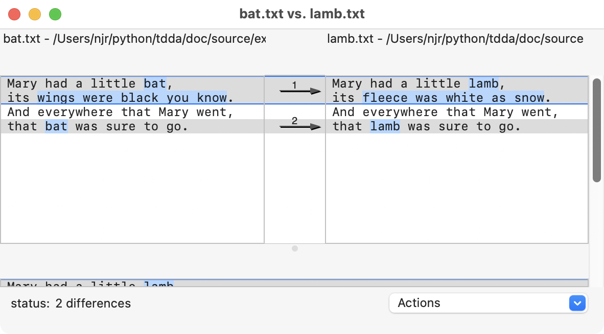
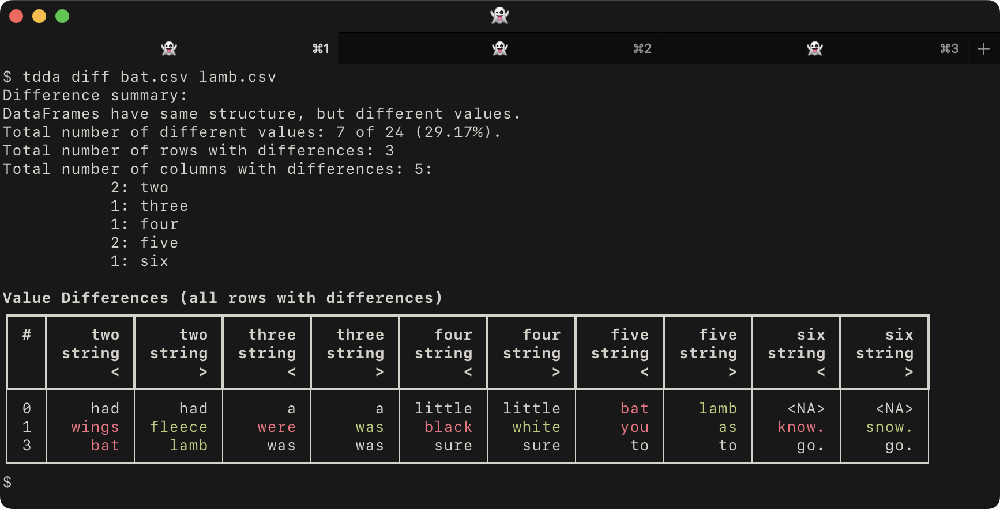
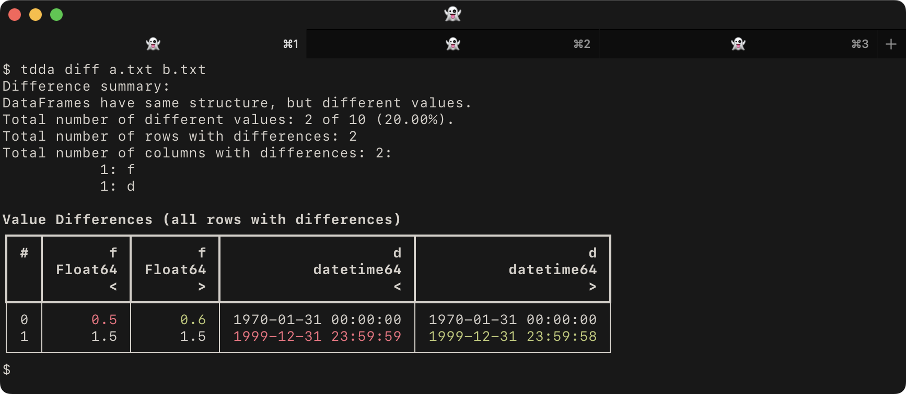
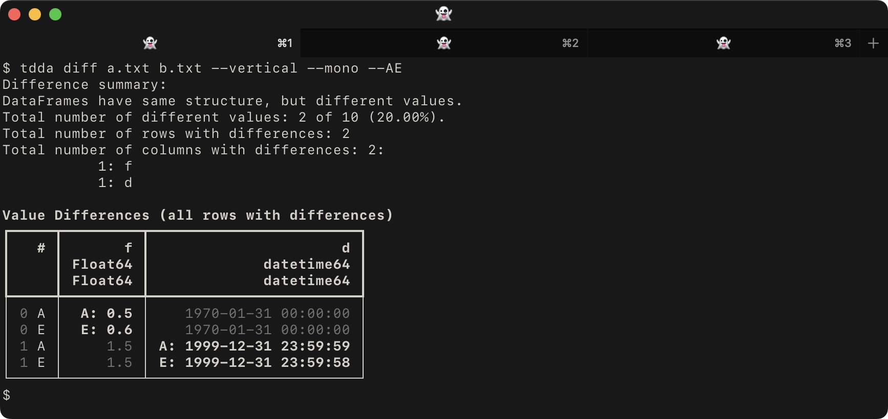

# tdda diff: Display Differences in Tabular Data (DataFrames and Flat Files)

## The Problem [`tdda diff`](cli.md#tdda-diff) Addresses

[`tdda diff`](cli.md#tdda-diff) aims to be a visual diff for tabular data. To explain:

 - The traditional Unix/Linux `diff` command (and `git diff`) show
   lines that are different between two files, usually with either
   `<` to indicate the left (first) file and `>` to indicate the right (second).

 - For example:

        diff bat.txt lamb.txt

   produces

        $ diff bat.txt lamb.txt
        1,2c1,2
        < Mary had a little bat
        < its wings were black you know
        ---
        > Mary had a little lamb
        > its fleece was white as snow.
        4c4
        < that bat was sure to go.
        ---
        > that lamb was sure to go.

   when `lamb.txt` contains:

       Mary had a little lamb
       its fleece was white as snow.
       And everywhere that Mary went
       that lamb was sure to go.

   and `bat.txt` contains

       Mary had a little bat
       its wings were black you know
       And everywhere that Mary went
       that bat was sure to go.

    The output is actually a `patch`-format script with commands that transform
    the left-hand side into the right-hand side, which is where the numbers
    come in. The lines with `<` are from `bat.txt` and the ones with `>`
    are from `lamb.txt`.

 - ‘Visual’ diff tools are similar but usually show the whole of each
   file side by side, highlighting the specific parts of lines that
   are different and allowing the two to be scrolled “in sync” even
   when there are blocks of lines only in one or the other. They often
   use colour as well (as does `git diff`).

     For example, this is the output from the Mac's `opendiff` visual
     diff tool with the same two files.

  

 - If the two files are identical, `diff` produces no output (and exits
   with code 0), and `opendiff` says "No differences" (and exits with code 0).

 - [`tdda diff`](cli.md#tdda-diff) uses the functionality for comparing DataFrames in
   reference testing to provide a capability somewhere between these
   for datasets stored as either parquet files or flat files such as
   CSV files. It also exposes some of the extra options provided by
   referencetest's `assertDataFramesEquivalent` and similar methods.

   For example, if we use a pair of csv files that are very similar
   to the text files we used, with a header line and commas
   instead of spaces between the words (because all the lines have
   six comma-separated values, including two blanks) and use
   [`tdda diff`](cli.md#tdda-diff), we get this:

   

   with `bat.csv` as

       one,two,three,four,five,six
       Mary,had,a,little,bat,
       its,wings,were,black,you,know.
       And,everywhere,that,Mary,went,
       that,bat,was,sure,to,go.

   and `lamb.csv` as

      one,two,three,four,five,six
      Mary,had,a,little,lamb,
      its,fleece,was,white,as,snow.
      And,everywhere,that,Mary,went,
      that,lamb,was,sure,to,go.

 - Notice that the default [`tdda diff`](cli.md#tdda-diff) output:
    - Starts by summarizing the differences (if any)
    - Then shows a table with
      - Only the rows and columns with differences
      - Different values highlighted in red (left)
        and green (right), and shared values in the terminal's
        main colour (e.g. white, here, given the dark background).
      - Columns interleaved from the two datasets.
      - It reports the type of the values and uses `<` to denote
        the left (first) dataset and `>` for the right (second) dataset.
    - Then exits with code 1 (indicating differences).

 - Again, if there are no differences, it produces no output and exits with
   code zero.

## Data Types and Specificity

The [`tdda diff`](cli.md#tdda-diff) functionality is new and somewhat experimental, but is
powerful.

In the case of tables stored in Parquet files, these are just loaded
as DataFrames, with types based on Parquet. There are some options
about whether to use Pandas or Polars, and in the case of Pandas,
which back-end to use, but at least there *is* type information.

Flat files, such as CSV files, do not normally carry explicit type information,
so loading the data into a DataFrame sometimes requires decisions to be
made. There are several choices:

  1. If nothing is specified the flat file is loaded using
     `tdda.serial.csv_to_pandas` (by default),
     or `tdda.serial.csv_to_polars` if polars is specified
     with `--polars` or by configuration.
     TDDA Serial uses `pandas.read_csv` or `polars.read_csv`,
     changing some default values.

  2. If metadata is available describing the format of the flat file,
     the colon syntax can be used to ask TDDA to use the metadata.

     Specifying `bat.csv:` will get TDDA to look for a suitable
     metadata file using naming conventions, most often `@.serial`
     or `bat-metadata.json` in the same directory. CSVW and Frictionless
     files can also be used.

     Specifying `bat.csv:bat-metadata.json` tells TDDA to use the
     metadata in `bat-metadata.json`.

For more detail on this,
see [tdda.serial colon format](serialformat.md#tdda-serial-colon-format).

The left-hand and right-hand files can be in different format,
i.e. comparisons between parquet and flat files are allowed,
and also between flat files in quite different formats.

Three options are available for controlling how closely types
must match (`--loose`, `--medium`, and `--strict`).

Similarly, for floating-point comparisons, `--dps N` can be used to
specify the level of precision (decimal places).

Named fields can be excluded from the comparison with

    --xfields FIELD1,FIELD2,...

or a subset can be explicitly specified for comparison with

    --fields FIELD1,FIELD2,...

If the comparison engine is Pandas (the current default), the backend
can be overridden by using `--backend BACKEND` (or `-B BACKEND`)
where `BACKEND` is any
of `n` for `numpy_nullable` (the default), `a` for `pyarrow`,
or `o` for original (non-nullable `ints` etc.)

## Performance and Streaming

Currently, the whole of both files have to be read in before the comparison
is performed and output is generated after the full comparison is carried out.
This means

1. Both files must fit comfortably in memory (together)
2. Very large files with no difference or a single difference may take
   a long time.
3. Files with huge numbers of differences will generate large output,
   though `--maxdiffs N` can be used to control this.
   (By default, there is no limit, i.e. all differences are shown).

Future versions may read the files in chunks and stream the output.

## Formatting

The output can become wide in the default format if either there are many
fields with differences, or fields with long values (particularly string
values) with differences. Long field names can also cause this.

The `--vertical` (`-V`) flag causes lines from the left and right files
to be stacked instead of shown side-by-side.

Colours can be controlled with `--colours C` (`-c C`) where c is a
hyphen-separated pair of colour names such as
`red-blue`, `red-green` etc. The default is `red-green`;
this can be changed in the configuration file
(see [Configuration](/configuration)).

Monochrome output can be requested with `--mono` (different values in bold,
shared values dimmed) or `--bw` (different values in bold, shared values
in the terminal's default style).

The markers used for left and right datasets can also be chosen with any
of

    --angles  the default < and >
    --LR      L: and R:
    --AE      A: and E: (for actual and expected)
    --pm      + and -

Alternatively, they can be set explicitly with `--prefixes PREFIXES`
where `PREFIXES` is a hyphen-separated pair of prefixes such as
`'actual:-ref:'` or `'actual: -ref: '` to have spaces included.

## Joins, Keys, Field Order, and Row Order

By default, [`tdda diff`](cli.md#tdda-diff) compares datasets row by row, in order,
so if the order is different, or if there are missing rows on one side
or the other, this will be reflected in the output. (This is quite
different from `diff`.)

The `--key FIELDS` flag can be used with a single field or a
comma-separated list of fields in `FIELDS` to specify a join key.
An outer join will be done on those fields before the comparison is run.
The field or fields specified must be a primary key for both datasets,
i.e. there must be no duplicates across the keys used.

Similarly, the structure is considered important, and if the left
and right-hand datasets have different column order, this will be
reported and the diff will stop.

The ability to specify a sort order for rows or to ignore column order
is likely to be added in the future. For example, given the files `a.txt`:

    b,i,f,s,d
    False,0,0.5,,1970-01-31T00:00:00
    True,1,1.5,a,1999-12-31T23:59:59

and `b.txt`

    b,i,f,s,d
    False,0,0.6,,1970-01-31T00:00:00
    True,1,1.5,a,1999-12-31T23:59:58

the default [`tdda diff`](cli.md#tdda-diff) would give:

   

whereas using the `--vertical`, `--mono` and `--AE` would give:

   

